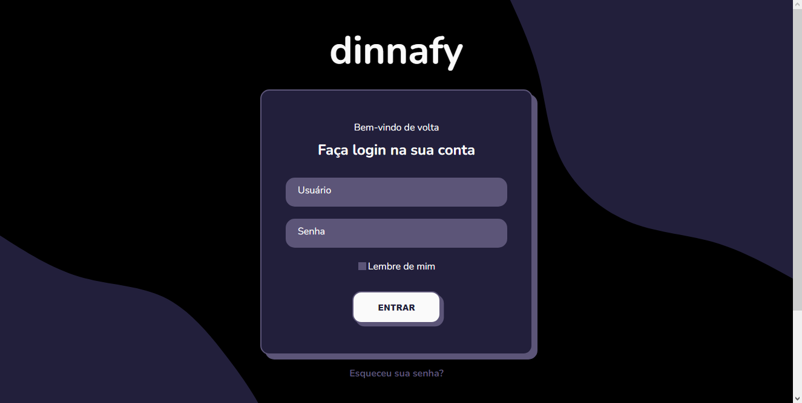

# dinnafy-login

<h4 align="center"><a href="https://dinnafy-login.vercel.app/">Clique para visitar o projeto</a></h4>

## 🎯 Objetivo

Este projeto é uma Página de Login, que foi desenvolvido como principal objetivo em treinar minhas habilidades em desenvolvimento de formulário utilizando HTML e no uso de pseudo-classes em CSS.

## 🛠️ Tecnologias utilizadas

Para o desenvolvimento deste site utilizei as seguintes tecnologias:

- HTML;
- CSS;
